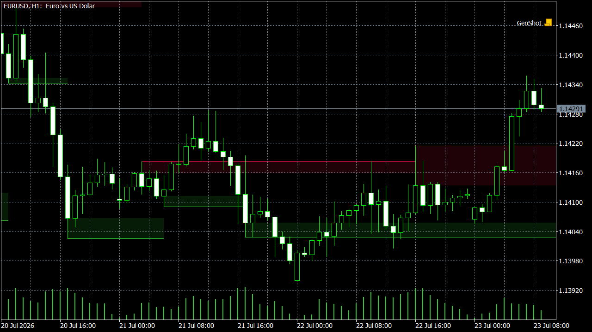

# FractoVol

Porte C++/MQL5 de um indicador de price action — zonas de suporte e resistência derivadas de fractais de preço validados por volume — para uso no MetaTrader 5.

## O que é

FractoVol é um porte do indicador Pine "Volume-based Support & Resistance Zones V2", publicado na TradingView por tommyf1001 (que credita trabalho anterior de synapticex e Lij_MC como base da lógica original), reimplementado do zero em C++ (motor de cálculo, compilado como DLL x64) e MQL5 (wrapper de plotagem para o MetaTrader 5).

A detecção segue um fractal de Williams de 5 barras:

- Resistência: pivô de topo confirmado por 3 highs sucessivos ascendentes seguidos de 2 highs descendentes.
- Suporte: o mesmo padrão espelhado com lows.
- Confirmação por volume: o fractal só é validado se o volume da barra do pivô superar a média móvel simples de volume, com período configurável.

Cada fractal validado gera uma zona (box) delimitada entre o nível do fractal (o high ou o low do pivô) e a borda do corpo do candle daquela barra (o maior entre open/close para resistência, o menor para suporte) — a distância entre essas duas bordas reflete a significância do nível.

O indicador suporta até 4 timeframes simultâneos (o timeframe atual do gráfico mais 3 configuráveis), com extensão de linhas para a direita, rótulos de timeframe nas zonas ativas e alertas de toque/rompimento configuráveis por timeframe.

No porte, o motor C++ é stateless: processa uma série OHLCV por chamada e devolve as zonas encontradas. O suporte a múltiplos timeframes é resolvido no wrapper MQL5, que chama o motor uma vez por timeframe configurado, alimentando-o com os dados de `CopyRates` daquele período.

## Instalação — versão pré-compilada

1. Copie `volume_sr.dll` para a pasta `MQL5/Libraries` do terminal MetaTrader 5.
2. Copie `TV_14_VolumeSR.ex5` para a pasta `MQL5/Indicators` do mesmo terminal.
3. Reinicie o MetaTrader 5 (ou, no Navegador, atualize/recarregue a lista de indicadores).
4. Arraste o indicador `TV_14_VolumeSR` do Navegador para o gráfico desejado e ajuste os parâmetros de timeframe e volume na janela de propriedades.

## Build a partir do código-fonte

1. Compile o motor C++ (`volume_sr`) com g++/MinGW-w64 usando o `build.sh` incluso em `src/cpp/` — o script gera `volume_sr.dll` (x64).
2. Abra `src/mql5/TV_14_VolumeSR.mq5` no MetaEditor do MetaTrader 5.
3. Compile com F7 para gerar `TV_14_VolumeSR.ex5`.
4. Siga os passos de instalação acima para colocar o `.dll` em `MQL5/Libraries` e o `.ex5` em `MQL5/Indicators`.

## Licença

Este repositório é licenciado sob MIT; a lógica original do indicador, escrita em Pine Script, é de autoria de tommyf1001.

## Aviso

Uso educacional e de análise técnica. Este indicador não constitui recomendação de investimento.
